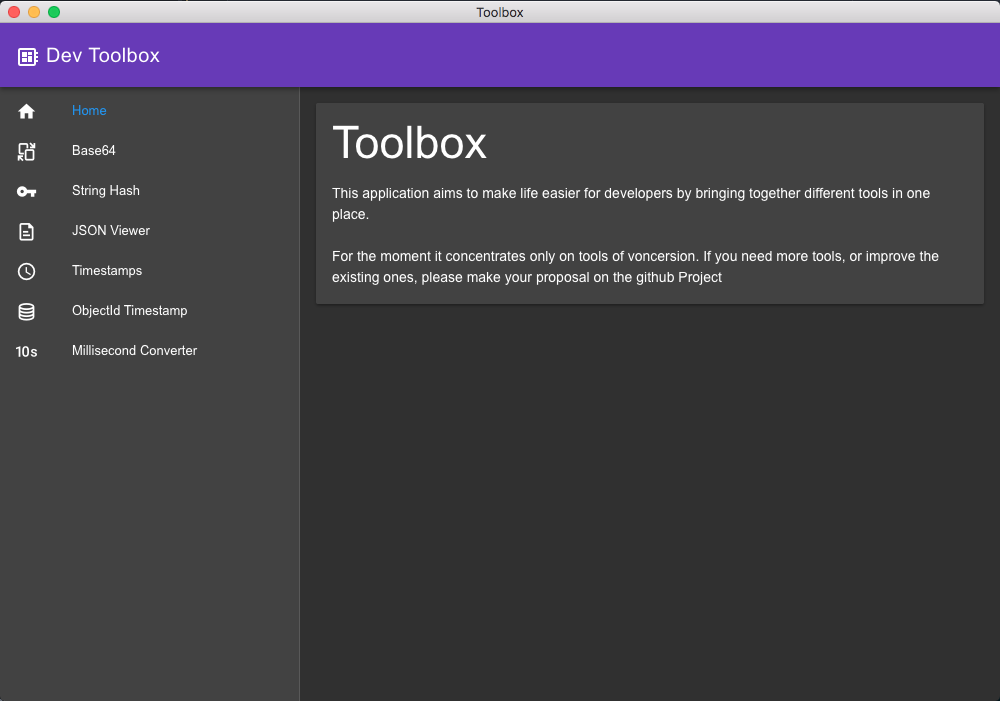

# electron-toolbox


This application aims to make life easier for developers by bringing together different tools in one place.

For the moment it concentrates only on tools of conversion. If you need more tools, or improve the existing ones, please make your proposal on issues.



## Features

- Base64 encode/decode
- String hash generator :
    - MD5
    - SHA-1
    - SHA-256
    - SHA-512
    - RIPEMD-160
- JSON Viewer
- Timestamp converter
    - Human readable
    - Unix Epoch (second)
    - ISO 8601
- ObjectId Timestamp extractor
- Millisecond Converter using ms library

## Development

```
npm install
npm run postinstall
npm run both
```

## License

MIT &copy; throrin19
